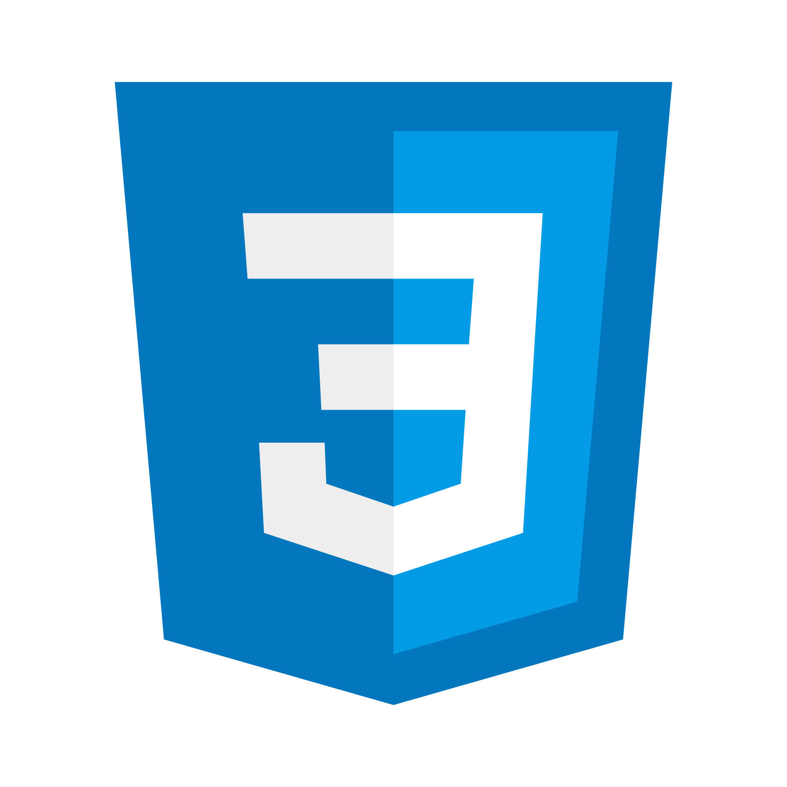

<h1>Salut, je suis Jordan:wave:</h1>

### Mes informations
- 🔭 Comment me contacter: [Discord](https://discord.gg/EShYTc4QYv) | [YouTube](https://www.youtube.com/channel/UCfOsdb3unk_Xdc058E9NcfQ) 
- 🌱 Je développe mes projets en language __JavaScript__, __CSShap__, __Html__, __Ts__

  

### Je suis un programmeur en beta testeur !
- Je m'appelle Jordan, je suis programmeur web et développeur discord je suis aussi étudiant 
- je crée des sites lorsque je suis libres  
 

### Mes projets actuels
- [Slywinter](https://www.slywinter.fr/)
- [Nova](https://discord.gg/EShYTc4QYv)
- [AᴜᴅɪᴏVɪsᴜᴇʟ Mᴏɴᴛᴀɢᴇ Oғғɪᴄɪᴇʟ](https://discord.gg/Ny6yZU5SMw)
  

### Mes anciens projets
- Maël
- Sly-off
- Gta 0.5k

