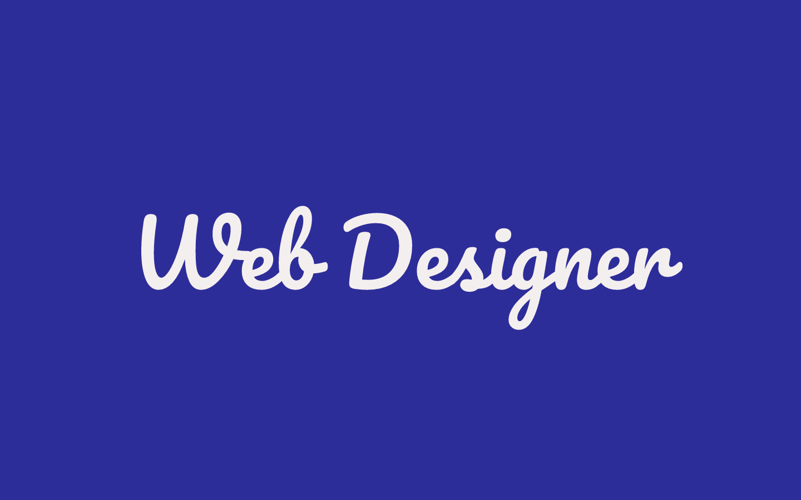

<h1>Salut !:wave:</h1>

### Mes informations
- 🔭 Comment me contacter: [Discord](https://discord.gg/zSb5MCub3k) | [WebSite](https://google.com)
- 🌱 Je développe mes projets en language __JavaScript__, __CSS3__, __SASS__, __Html5__, __TypeScript__, __Ejs__.

### Je suis un programmeur en bêta testeur !
- Je m'appelle Jordan, je suis programmeur web et développeur discord je suis aussi étudiant.
- Je crée des **sites web** et des bot **discord** lorsque j'ai du temps libre.
- Sinon je suis très sociable et très gentil.
- Donc si vous voulez discuté un jour avec moi, je serai content de parler de mes passions avec vous.
- Si vous avez des questions sur mes passions je serai très heureux de vous réppondre.
 

### 📊 Statistiques Github 

</a>
 </a>
